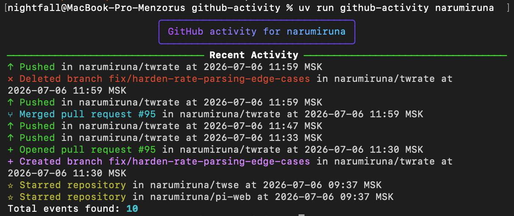
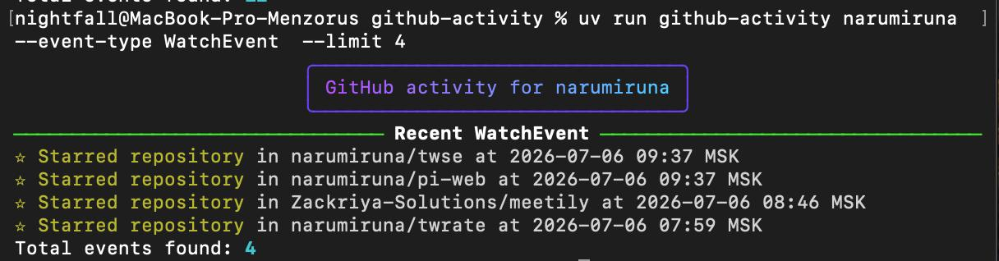

# GitHub Activity CLI

A simple command-line tool that shows the recent public activity of a GitHub user.

This project is based on the [roadmap.sh GitHub User Activity](https://roadmap.sh/projects/github-user-activity) project idea.

## Features

- Fetch recent public GitHub activity by username
- Display activity in a readable, colored CLI format
- Format common GitHub events into human-friendly messages
- Show activity dates in your local timezone
- Limit the number of displayed events
- Filter activity by GitHub event type
- Use a GitHub token for authenticated API requests
- Handle invalid usernames and API errors
- Use the public GitHub Events API
- Built with Python and Typer

## Requirements

- Python 3.13 or newer
- uv

## Installation

Clone the repository:

```bash
git clone https://github.com/Curseppp/github-activity.git
cd github-activity
```
Install dependencies with uv:
```bash
uv sync
```

## Usage
Select the user whose public activity you want to view and enter their name as a command line parameter.

For example: 
```bash
uv run github-activity Curseppp
```

Limit the number of displayed events:

```bash
uv run github-activity Curseppp --limit 5
```

Filter activity by event type:

```bash
uv run github-activity Curseppp --event-type PushEvent
```

You can combine both options:

```bash
uv run github-activity Curseppp --limit 10 --event-type IssuesEvent
```

Example output:

```text
↑ Pushed in Curseppp/github-activity at 2026-07-05 20:16 MSK
+ Created branch main in Curseppp/github-activity at 2026-07-05 13:01 MSK
✓ Merged pull request #12 in owner/repo at 2026-07-04 18:30 MSK
✎ Commented on issue #7 in owner/repo at 2026-07-04 17:05 MSK
```

## Screenshots

```bash
uv run github-activity narumiruna
```


```bash
uv run github-activity narumiruna  --event-type WatchEvent  --limit 4
```


The tool reads recent public events from GitHub. Private activity is not available through the public events endpoint.

When an event type is selected, the CLI can scan multiple GitHub Events API pages to find matching events, then display up to the requested limit.

## GitHub Token

The CLI can use a GitHub token for authenticated API requests and higher rate limits.

Run the setup command and paste your token when prompted:

```bash
uv run github-activity setup
```

This creates or updates a local `.env` file with:

```text
GITHUB_TOKEN=your-token
```

## Supported Events

| GitHub event | Displayed as | Data used |
| --- | --- | --- |
| `PushEvent` | Push activity | Repository, created date, commit count when available |
| `CreateEvent` | Created branch, tag, or repository | `ref_type`, `ref` |
| `DeleteEvent` | Deleted branch or tag | `ref_type`, `ref` |
| `PullRequestEvent` | Opened, closed, merged, reopened, or updated pull request | `action`, pull request number, merged status |
| `PullRequestReviewEvent` | Approved, requested changes, commented, or dismissed review | Pull request number, review state, action |
| `PullRequestReviewCommentEvent` | Commented on a pull request file | Pull request number, comment path, action |
| `IssuesEvent` | Opened, closed, reopened, assigned, unassigned, labeled, or unlabeled issue | Issue number, assignee, label, action |
| `IssueCommentEvent` | Commented on an issue or pull request | Issue number, target type, action |
| `WatchEvent` | Starred repository | Action |
